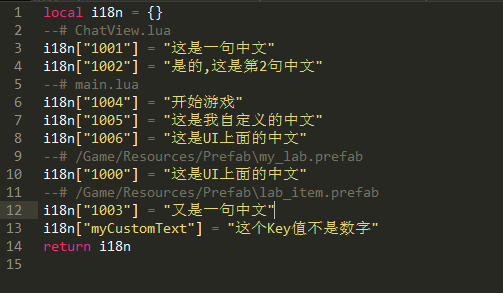

Unity 一键国际化工具
====

特性
-------  
### 代码
自动替换相关中文字符串

### UI
自动绑定UI上的中文文本

### 如何使用
在Editor/config.txt 有相关的工具配置 
Lua->Generate All 
Tools->i18n Export 
因为该项目结合了tolua,所以导出为lua。 

联系
-------
qq342854406  qq群347085657
